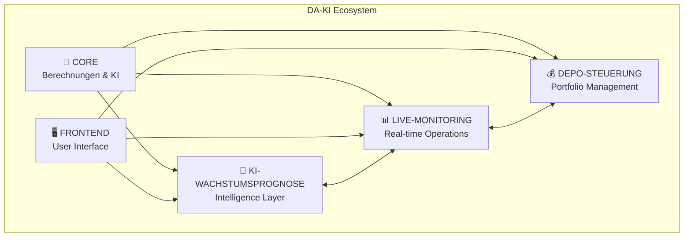
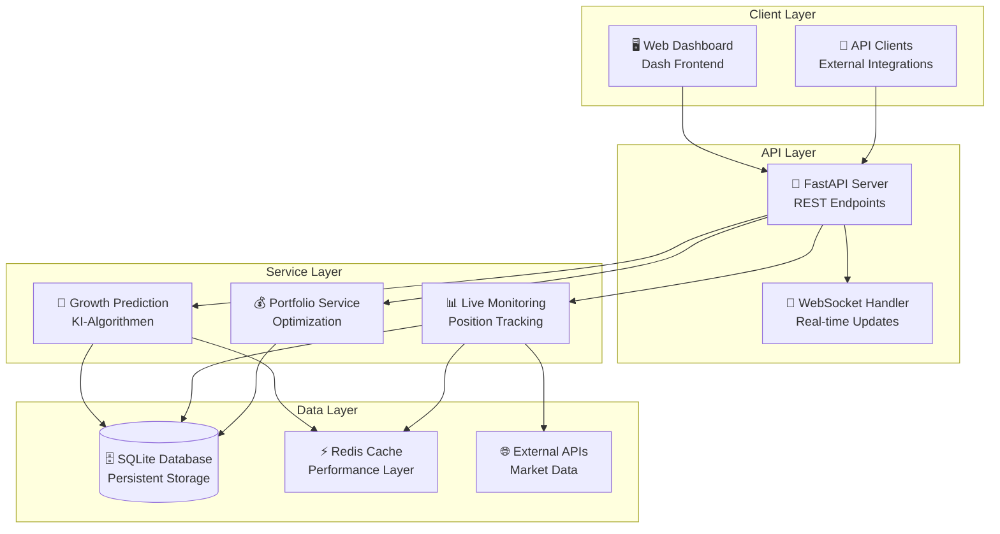
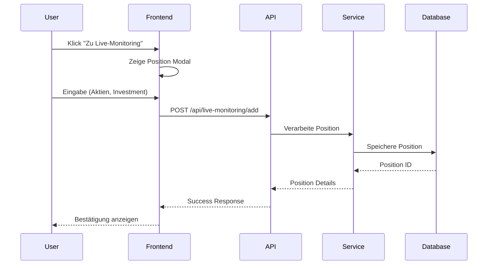
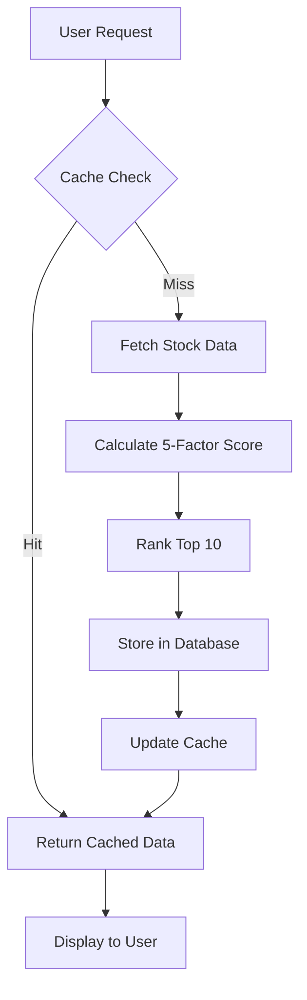
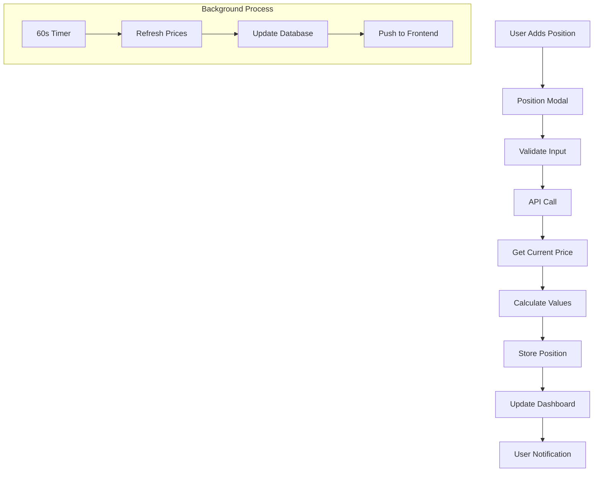
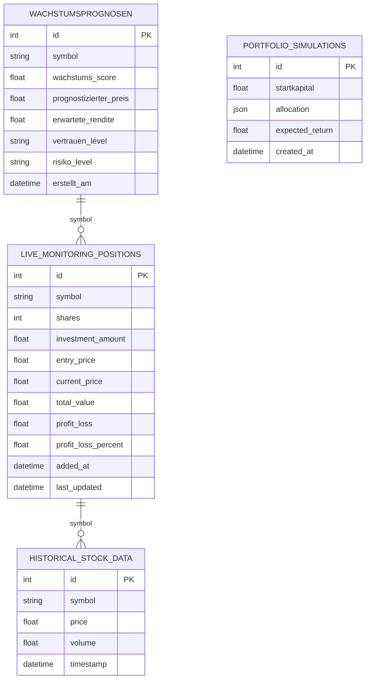
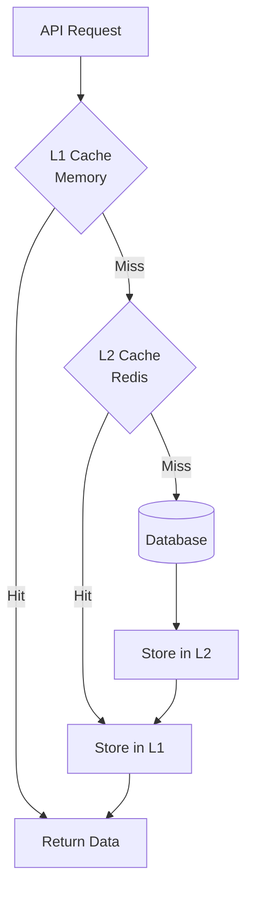
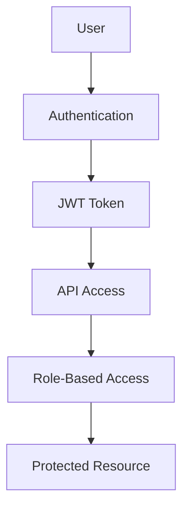
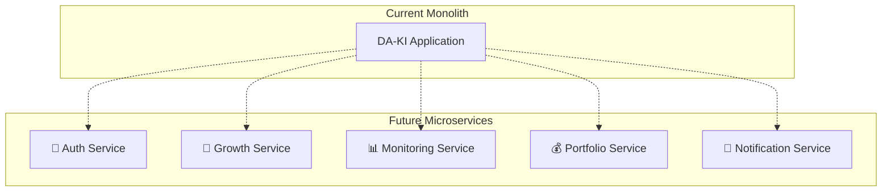
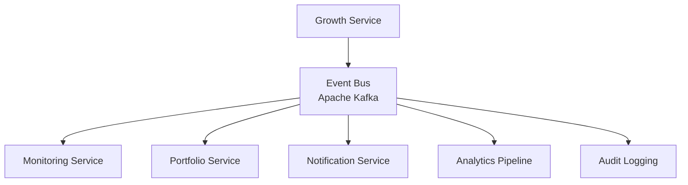

# 🏗️ DA-KI Architektur-Dokumentation

## 📋 Übersicht

DA-KI implementiert eine moderne, modulare Architektur basierend auf dem **Teilprojekt-Konzept** mit klarer Trennung von Verantwortlichkeiten. Die Anwendung folgt einer **Service-orientierten Architektur (SOA)** mit REST-APIs und reaktiven Frontend-Komponenten.

## 🎯 Teilprojekt-Architektur



### Teilprojekt-Details

| Teilprojekt | Verantwortlichkeiten | Technologien | Status |
|-------------|---------------------|--------------|---------|
| **CORE** | Basis-Algorithmen, Datenmodelle, Utils | Python, SQLite, Pandas | ✅ Produktiv |
| **FRONTEND** | UI/UX, Dashboards, User Interactions | Dash, Plotly, HTML/CSS | ✅ Produktiv |
| **KI-WACHSTUMSPROGNOSE** | ML-Modelle, Scoring-Algorithmen | Scikit-learn, NumPy | ✅ Implementiert |
| **LIVE-MONITORING** | Real-time Data, WebSockets | AsyncIO, WebSockets | 🚧 Enhanced |
| **DEPO-STEUERUNG** | Portfolio-Optimierung, Trading | Optimization Libs | 📋 Geplant |

## 🏛️ System-Architektur

### High-Level Architecture



### Component Interaction



## 📁 Datei-Organisation

### Directory Structure

```
DA-KI/
├── 📁 api/                           # API Layer
│   ├── api_top10_final.py           # Haupt-API Server
│   ├── endpoints/                   # Modularisierte Endpoints
│   │   ├── __init__.py
│   │   ├── wachstumsprognose.py    # Growth Prediction APIs
│   │   ├── monitoring.py           # Live Monitoring APIs  
│   │   └── portfolio.py            # Portfolio Management APIs
│   └── middleware/                  # API Middleware
│       ├── auth.py                 # Authentication
│       ├── cache.py                # Caching Layer
│       └── cors.py                 # CORS Configuration
├── 📁 frontend/                     # Frontend Layer
│   ├── dashboard_top10.py          # Haupt-Dashboard
│   ├── components/                 # UI Components
│   │   ├── __init__.py
│   │   ├── growth_cards.py         # Wachstums-Karten
│   │   ├── monitoring_table.py     # Live-Monitoring Tabelle
│   │   ├── portfolio_simulator.py  # Portfolio-Simulation
│   │   └── modals.py               # Modal Dialoge
│   ├── layouts/                    # Layout Templates
│   └── assets/                     # Static Assets (CSS, JS)
├── 📁 services/                     # Service Layer
│   ├── __init__.py
│   ├── growth_prediction_top10.py  # KI-Wachstumsprognose
│   ├── live_monitoring.py          # Live-Monitoring Service
│   ├── portfolio_optimizer.py      # Portfolio-Optimierung
│   ├── data_manager.py             # Datenverarbeitung
│   └── external_apis/              # External API Integrations
│       ├── yahoo_finance.py
│       ├── google_search.py
│       └── market_data.py
├── 📁 database/                     # Data Layer
│   ├── aktienanalyse_de.db         # SQLite Hauptdatenbank
│   ├── schemas/                    # Database Schemas
│   │   ├── __init__.py
│   │   ├── wachstumsprognosen.sql
│   │   ├── live_monitoring.sql
│   │   └── portfolio.sql
│   ├── migrations/                 # Database Migrations
│   └── seeders/                    # Test Data
├── 📁 tests/                       # Test Suite
│   ├── __init__.py
│   ├── test_api/                   # API Tests
│   ├── test_services/              # Service Tests
│   ├── test_frontend/              # Frontend Tests
│   └── integration/                # Integration Tests
├── 📁 docs/                        # Documentation
│   ├── ARCHITECTURE.md             # Diese Datei
│   ├── API.md                      # API Dokumentation
│   ├── DEPLOYMENT.md               # Deployment Guide
│   └── DEVELOPMENT.md              # Development Guide
├── 📁 scripts/                     # Utility Scripts
│   ├── setup.py                   # Setup Script
│   ├── migrate.py                 # Database Migration
│   └── seed_data.py               # Data Seeding
└── 📁 config/                      # Configuration
    ├── development.py
    ├── production.py
    └── testing.py
```

## 🔄 Data Flow Architecture

### Wachstumsprognose Flow



### Live-Monitoring Flow



## 💾 Database Design

### Entity Relationship Diagram



### Database Schema Evolution

```sql
-- Version 1: Basic Schema
CREATE TABLE wachstumsprognosen (
    id INTEGER PRIMARY KEY AUTOINCREMENT,
    symbol TEXT NOT NULL,
    wachstums_score REAL NOT NULL,
    erstellt_am TIMESTAMP DEFAULT CURRENT_TIMESTAMP
);

-- Version 2: Enhanced Live Monitoring  
CREATE TABLE live_monitoring_positions (
    id INTEGER PRIMARY KEY AUTOINCREMENT,
    symbol TEXT NOT NULL,
    shares INTEGER NOT NULL,
    investment_amount REAL NOT NULL,
    entry_price REAL,
    current_price REAL,
    total_value REAL,
    profit_loss REAL,
    profit_loss_percent REAL,
    added_at TIMESTAMP DEFAULT CURRENT_TIMESTAMP,
    last_updated TIMESTAMP DEFAULT CURRENT_TIMESTAMP
);

-- Version 3: Portfolio Management (Geplant)
CREATE TABLE portfolio_allocations (
    id INTEGER PRIMARY KEY AUTOINCREMENT,
    portfolio_id INTEGER,
    symbol TEXT NOT NULL,
    target_weight REAL NOT NULL,
    current_weight REAL,
    rebalance_threshold REAL DEFAULT 0.05
);
```

## 🚀 API Architecture

### REST API Design

```yaml
# OpenAPI 3.0 Schema
openapi: 3.0.0
info:
  title: DA-KI API
  version: 2.0.0
  description: Deutsche Aktienanalyse mit KI-Wachstumsprognose

paths:
  /api/wachstumsprognose/top10:
    get:
      summary: Top 10 Wachstumsaktien
      responses:
        200:
          description: Erfolgreiche Antwort
          content:
            application/json:
              schema:
                type: object
                properties:
                  top_10_wachstums_aktien:
                    type: array
                    items:
                      $ref: '#/components/schemas/WachstumsAktie'
                  cache_status:
                    type: string
                  nächste_aktualisierung:
                    type: string

  /api/live-monitoring/add:
    post:
      summary: Position hinzufügen
      requestBody:
        required: true
        content:
          application/json:
            schema:
              $ref: '#/components/schemas/PositionRequest'
      responses:
        201:
          description: Position erfolgreich hinzugefügt
          
components:
  schemas:
    WachstumsAktie:
      type: object
      properties:
        symbol:
          type: string
        name:
          type: string
        wachstums_score:
          type: number
        current_price:
          type: number
        prognose_30_tage:
          $ref: '#/components/schemas/Prognose'
          
    PositionRequest:
      type: object
      required:
        - symbol
        - shares
        - investment
      properties:
        symbol:
          type: string
        shares:
          type: integer
          minimum: 1
        investment:
          type: number
          minimum: 0.01
```

### API Versioning Strategy

```python
# Version 1: /api/v1/...  (Legacy)
# Version 2: /api/...     (Current)
# Version 3: /api/v3/...  (Future)

@app.get("/api/v1/wachstumsprognose")  # Deprecated
@app.get("/api/wachstumsprognose/top10")  # Current
@app.get("/api/v3/growth/predictions")  # Future
```

## ⚡ Performance Architecture

### Caching Strategy



### Asynchronous Processing

```python
# AsyncIO Pattern für Parallel Processing
async def berechne_alle_aktien_parallel():
    tasks = []
    for symbol in aktien_liste:
        task = asyncio.create_task(berechne_einzelne_aktie(symbol))
        tasks.append(task)
    
    results = await asyncio.gather(*tasks, return_exceptions=True)
    return results

# WebSocket für Real-time Updates  
@app.websocket("/ws/live-monitoring")
async def websocket_endpoint(websocket: WebSocket):
    await websocket.accept()
    while True:
        # Send real-time updates
        data = await get_live_monitoring_data()
        await websocket.send_json(data)
        await asyncio.sleep(60)  # 60 second intervals
```

## 🔐 Security Architecture

### Authentication & Authorization



### Security Measures

```python
# CORS Configuration
app.add_middleware(
    CORSMiddleware,
    allow_origins=["http://10.1.1.110:8054"],
    allow_credentials=True,
    allow_methods=["*"],
    allow_headers=["*"],
)

# Rate Limiting
@app.middleware("http")
async def rate_limit_middleware(request, call_next):
    # Implement rate limiting logic
    pass

# Input Validation
class PositionRequest(BaseModel):
    symbol: str = Field(..., regex="^[A-Z]{1,5}$")
    shares: int = Field(..., gt=0, le=10000)
    investment: float = Field(..., gt=0.01, le=1000000)
```

## 📊 Monitoring & Observability

### Application Metrics

```python
# Prometheus Metrics Integration
from prometheus_client import Counter, Histogram, Gauge

api_requests_total = Counter('api_requests_total', 'Total API requests', ['method', 'endpoint'])
response_time_seconds = Histogram('response_time_seconds', 'Response time in seconds')
active_positions_gauge = Gauge('active_positions', 'Number of active monitoring positions')
```

### Logging Strategy

```python
import logging
import structlog

# Structured Logging
logger = structlog.get_logger()

@app.middleware("http")
async def logging_middleware(request, call_next):
    start_time = time.time()
    response = await call_next(request)
    process_time = time.time() - start_time
    
    logger.info(
        "api_request",
        method=request.method,
        url=str(request.url),
        status_code=response.status_code,
        process_time=process_time
    )
    return response
```

## 🔮 Future Architecture Considerations

### Microservices Evolution



### Cloud-Native Deployment

```yaml
# Kubernetes Deployment Example
apiVersion: apps/v1
kind: Deployment
metadata:
  name: da-ki-api
spec:
  replicas: 3
  selector:
    matchLabels:
      app: da-ki-api
  template:
    metadata:
      labels:
        app: da-ki-api
    spec:
      containers:
      - name: api
        image: da-ki/api:latest
        ports:
        - containerPort: 8003
        env:
        - name: DATABASE_URL
          value: "postgresql://..."
        - name: REDIS_URL
          value: "redis://..."
```

### Event-Driven Architecture



## 📋 Architecture Decision Records (ADRs)

### ADR-001: Teilprojekt-basierte Architektur
- **Status**: Accepted
- **Context**: Modulare Entwicklung und klare Verantwortlichkeiten
- **Decision**: 5-Teilprojekt Struktur (CORE, FRONTEND, KI, LIVE, DEPO)
- **Consequences**: Bessere Skalierbarkeit, einfachere Wartung

### ADR-002: SQLite als primäre Datenbank
- **Status**: Accepted  
- **Context**: Einfache Deployment, ausreichende Performance für MVP
- **Decision**: SQLite für lokale Entwicklung, Migration zu PostgreSQL geplant
- **Consequences**: Schnelle Entwicklung, spätere Migration erforderlich

### ADR-003: FastAPI + Dash Framework
- **Status**: Accepted
- **Context**: Moderne Python Web-Frameworks
- **Decision**: FastAPI für API, Dash für interaktive Dashboards
- **Consequences**: Hohe Entwicklungsgeschwindigkeit, Python-Konsistenz

---

**📝 Architektur-Dokumentation | Version 2.0 | DA-KI Project**

*Entwickelt mit [Claude Code](https://claude.ai/code) - Moderne KI-gestützte Softwareentwicklung*