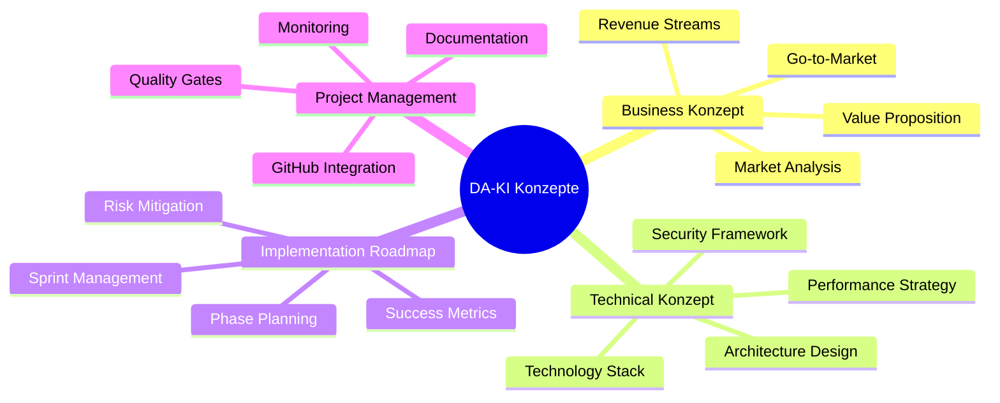
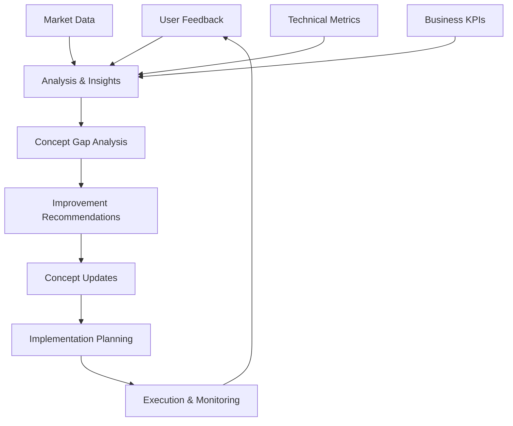

# 🎯 DA-KI Konzept-Übersicht & Strategische Ausrichtung

## 📋 Executive Summary

**DA-KI (Deutsche Aktienanalyse mit KI-Wachstumsprognose)** ist eine intelligente Fintech-Plattform, die durch strukturierte Konzeptentwicklung und systematische Implementierung eine neue Generation der Aktienanalyse für den deutschen Markt definiert.

### 🏗️ Konzeptstruktur-Framework



---

## 🎯 Konzeptuelle Grundpfeiler

### 1. 🏢 **Business Logic & Strategische Ausrichtung**

#### Value Proposition Canvas
```yaml
Customer Jobs:
  - Profitable Aktienauswahl treffen
  - Zeitaufwand für Research reduzieren
  - Emotionale Investmentfehler vermeiden
  - Portfolio-Performance optimieren

Pain Points:
  - Informationsüberflutung bei Aktienanalyse
  - Fehlende objektive Bewertungskriterien
  - Zeitintensive Fundamentalanalyse
  - Emotionale Entscheidungsfindung

Gain Creators:
  - KI-basierte objektive Scoring-Algorithmen
  - Real-time Monitoring & Alerts
  - Automatisierte Portfolio-Optimierung
  - Datengetriebene Entscheidungsunterstützung
```

#### Business Model Innovation
- **Freemium SaaS**: Skalierbare Revenue-Streams
- **API-as-a-Service**: B2B-Partnerschaften
- **White-Label Platform**: Enterprise-Solutions
- **Data-as-a-Service**: Insights Monetization

### 2. ⚙️ **Technical Excellence & Architektur**

#### Architekturprinzipien
```yaml
Scalability First:
  - Microservices-orientierte Architektur
  - Container-native Development
  - Auto-scaling Capabilities
  - Load-balanced Infrastructure

Performance by Design:
  - Async-first Programming Model
  - Multi-level Caching Strategy
  - Real-time Data Processing
  - Optimized Database Queries

Security by Default:
  - Zero-trust Security Model
  - End-to-end Encryption
  - API Rate Limiting
  - GDPR Compliance Framework
```

#### Innovation Stack
- **KI/ML**: 5-Faktor Scoring mit Ensemble Methods
- **Real-time**: WebSocket + Server-Sent Events
- **Data Pipeline**: AsyncIO + Celery + Redis
- **Infrastructure**: Kubernetes + Prometheus + Grafana

### 3. 📅 **Strukturierte Implementation**

#### Phasen-Governance
```yaml
Phase 1 - Foundation (Q2 2025):
  Focus: Core MVP & Enhanced Features
  Success: 100 aktive Nutzer, Product-Market Fit
  
Phase 2 - Scale (Q3 2025):
  Focus: Performance & Infrastructure
  Success: 1000 Nutzer, 50K€ MRR
  
Phase 3 - Growth (Q4 2025):
  Focus: DACH Expansion & Enterprise
  Success: 5000 Nutzer, Multi-Market
  
Phase 4 - Global (2026):
  Focus: International & Platform Leadership
  Success: Series A, Global Presence
```

#### Quality Engineering
- **Test-Driven Development**: 90%+ Coverage
- **Continuous Integration**: Automated Testing
- **Performance Engineering**: Load Testing
- **Security Engineering**: Penetration Testing

---

## 🔄 Konzeptuelle Synergien & Abhängigkeiten

### 🎯 **Business ↔ Technical Alignment**

#### Revenue-Technical Mapping
| Business Requirement | Technical Implementation | Success Metric |
|----------------------|--------------------------|----------------|
| **Real-time Updates** | WebSocket + Redis Caching | <50ms Latency |
| **Scale to 1000 Users** | Kubernetes Auto-scaling | 99.9% Uptime |
| **API Monetization** | Rate Limiting + Analytics | 99.99% SLA |
| **Enterprise Security** | OAuth2 + Audit Logging | SOC2 Compliance |

#### Market-Product Fit Validation
```python
# Product-Market Fit Metrics Framework
class PMFTracker:
    def __init__(self):
        self.metrics = {
            'user_retention_7d': 0.40,      # Target: >40%
            'nps_score': 50,                 # Target: >50
            'organic_growth_rate': 0.20,     # Target: >20%
            'feature_adoption_rate': 0.60,   # Target: >60%
            'support_ticket_rate': 0.05      # Target: <5%
        }
    
    def calculate_pmf_score(self):
        weighted_score = (
            self.metrics['user_retention_7d'] * 0.30 +
            (self.metrics['nps_score'] / 100) * 0.25 +
            self.metrics['organic_growth_rate'] * 0.20 +
            self.metrics['feature_adoption_rate'] * 0.15 +
            (1 - self.metrics['support_ticket_rate']) * 0.10
        )
        return min(weighted_score * 100, 100)
```

### 🚀 **Implementation ↔ Architecture Synergy**

#### Sprint-Architecture Alignment
```yaml
Sprint Focus Areas:
  
  Performance Sprints:
    Architecture: Caching + AsyncIO + Database Optimization
    Implementation: Redis Multi-level, Parallel Processing
    Business Impact: 10x Response Time Improvement
  
  Scalability Sprints:
    Architecture: Microservices + Container Orchestration
    Implementation: Kubernetes + Auto-scaling + Load Balancing
    Business Impact: 1000+ Concurrent Users Support
  
  Security Sprints:
    Architecture: Zero-trust + API Gateway + Audit Logging
    Implementation: JWT + Rate Limiting + Security Headers
    Business Impact: Enterprise-ready Compliance
```

#### Technical Debt Management
```python
# Technical Debt Tracking System
class TechnicalDebtTracker:
    def __init__(self):
        self.debt_categories = {
            'performance': {'weight': 0.35, 'current_score': 70},
            'security': {'weight': 0.25, 'current_score': 85},
            'maintainability': {'weight': 0.20, 'current_score': 75},
            'scalability': {'weight': 0.15, 'current_score': 60},
            'documentation': {'weight': 0.05, 'current_score': 90}
        }
    
    def calculate_health_score(self):
        weighted_score = sum(
            category['weight'] * category['current_score']
            for category in self.debt_categories.values()
        )
        return weighted_score
    
    def prioritize_debt_reduction(self):
        # ROI-basierte Priorisierung
        priorities = []
        for category, data in self.debt_categories.items():
            impact = data['weight'] * (100 - data['current_score'])
            priorities.append((category, impact))
        
        return sorted(priorities, key=lambda x: x[1], reverse=True)
```

---

## 📊 Integrierte Success Metrics & KPIs

### 🎯 **Multi-dimensionale Erfolgsmessung**

#### Business Health Dashboard
```yaml
Revenue Metrics:
  - Monthly Recurring Revenue (MRR): Target 50K€ by Q4 2025
  - Customer Acquisition Cost (CAC): Target <100€
  - Lifetime Value (LTV): Target >500€
  - LTV/CAC Ratio: Target >5:1
  - Churn Rate: Target <5% monthly

Product Metrics:
  - Daily Active Users (DAU): Target 500+ by Q3 2025
  - Feature Adoption Rate: Target >60%
  - User Retention (7-day): Target >40%
  - Net Promoter Score (NPS): Target >60
  - Time to Value: Target <15 minutes

Technical Metrics:
  - API Response Time: Target <100ms (P95)
  - System Uptime: Target >99.9%
  - Error Rate: Target <0.1%
  - Deployment Frequency: Target Daily
  - Mean Time to Recovery: Target <1 hour
```

#### Balanced Scorecard Framework
| Perspektive | Kennzahl | Aktuell | Q3 Target | Q4 Target |
|-------------|----------|---------|-----------|-----------|
| **Financial** | MRR | 0€ | 25K€ | 50K€ |
| **Customer** | NPS Score | - | 50+ | 70+ |
| **Process** | Deploy Frequency | Manual | Daily | Multiple/Day |
| **Learning** | Team Velocity | - | 40 SP | 50 SP |

### 📈 **Predictive Analytics für Konzeptvalidierung**

#### Market Validation Framework
```python
# Market Opportunity Scoring
class MarketOpportunityAnalyzer:
    def __init__(self):
        self.factors = {
            'market_size': {
                'tam_dach': 3.5e9,           # €3.5B TAM DACH region
                'sam_target': 350e6,         # €350M SAM target segment
                'som_realistic': 35e6        # €35M SOM realistic capture
            },
            'competition': {
                'direct_competitors': 3,      # Trade Republic, Scalable, justtrade
                'indirect_competitors': 10,   # Traditional banks, Bloomberg, etc.
                'differentiation_score': 8.5  # 1-10 scale, our uniqueness
            },
            'technology_readiness': {
                'mvp_completeness': 0.75,     # 75% MVP ready
                'scalability_score': 0.80,   # Architecture scalability
                'security_score': 0.70       # Security implementation
            }
        }
    
    def calculate_opportunity_score(self):
        # Gewichtete Berechnung der Marktchancen
        market_score = min(self.factors['market_size']['som_realistic'] / 1e6, 100)
        competition_score = (10 - self.factors['competition']['direct_competitors']) * 10
        differentiation_score = self.factors['competition']['differentiation_score'] * 10
        tech_score = (
            self.factors['technology_readiness']['mvp_completeness'] * 30 +
            self.factors['technology_readiness']['scalability_score'] * 30 +
            self.factors['technology_readiness']['security_score'] * 40
        )
        
        weighted_score = (
            market_score * 0.30 +
            competition_score * 0.25 +
            differentiation_score * 0.25 +
            tech_score * 0.20
        )
        
        return min(weighted_score, 100)
```

---

## 🔮 Strategic Vision & Future Concepts

### 🚀 **Innovation Roadmap 2025-2027**

#### Emerging Technology Integration
```yaml
2025 Innovations:
  AI/ML Advancement:
    - GPT-4 integration für natural language queries
    - Computer vision für chart pattern recognition
    - Reinforcement learning für portfolio optimization
  
  Data Science:
    - Alternative data sources (satellite, social media)
    - Real-time sentiment analysis from news
    - ESG scoring integration
  
  User Experience:
    - Voice-activated portfolio management
    - AR/VR data visualization
    - Personalized AI financial advisor

2026-2027 Vision:
  Platform Evolution:
    - Blockchain integration für transparent scoring
    - Decentralized data marketplace
    - Cross-border regulatory compliance automation
  
  Market Expansion:
    - Crypto asset analysis integration
    - Commodities & forex expansion
    - Global market coverage (Asia-Pacific)
  
  Ecosystem Leadership:
    - Open-source algorithm contributions
    - Academic research partnerships
    - Industry standard definition participation
```

#### Competitive Moat Strategy
```python
# Sustainable Competitive Advantage Framework
class CompetitiveMoatBuilder:
    def __init__(self):
        self.moat_factors = {
            'data_network_effects': {
                'description': 'More users → better data → better algorithms',
                'strength': 7,  # 1-10 scale
                'building_blocks': [
                    'User behavior analytics',
                    'Portfolio performance tracking',
                    'Market reaction patterns'
                ]
            },
            'switching_costs': {
                'description': 'High cost/effort to switch to competitors',
                'strength': 6,
                'building_blocks': [
                    'Historical portfolio data',
                    'Customized algorithms',
                    'Integrated workflows'
                ]
            },
            'brand_trust': {
                'description': 'Reputation for accuracy and reliability',
                'strength': 5,
                'building_blocks': [
                    'Track record of predictions',
                    'Transparent methodologies',
                    'Security & compliance'
                ]
            },
            'cost_advantage': {
                'description': 'Lower cost structure than competitors',
                'strength': 8,
                'building_blocks': [
                    'Automated operations',
                    'Efficient infrastructure',
                    'Direct-to-consumer model'
                ]
            }
        }
    
    def calculate_moat_strength(self):
        total_strength = sum(factor['strength'] for factor in self.moat_factors.values())
        max_possible = len(self.moat_factors) * 10
        return (total_strength / max_possible) * 100
```

### 🌍 **Global Expansion Concept**

#### Market Entry Strategy
```yaml
Phase 1 - DACH Domination (2025):
  Markets: Germany, Austria, Switzerland
  Strategy: Localization + regulatory compliance
  Success: Market leader in German-speaking region

Phase 2 - European Expansion (2026):
  Markets: UK, France, Netherlands, Nordics
  Strategy: API partnerships + white-label solutions
  Success: Top 3 European FinTech platform

Phase 3 - Global Platform (2027):
  Markets: North America, Asia-Pacific
  Strategy: Acquisition + local partnerships
  Success: Global brand recognition
```

---

## 🎯 Konzept-Integration & Governance

### 📋 **Konzeptuelle Governance-Struktur**

#### Decision Making Framework
```yaml
Strategic Decisions (Quarterly):
  Participants: Founders, Advisors, Key Stakeholders
  Scope: Market strategy, major feature decisions, funding
  Tools: OKR reviews, market analysis, competitive intelligence

Technical Decisions (Monthly):
  Participants: Tech leads, senior developers
  Scope: Architecture changes, technology choices, security
  Tools: Technical RFCs, proof of concepts, security audits

Operational Decisions (Weekly):
  Participants: Product team, engineering leads
  Scope: Sprint planning, feature prioritization, bug fixes
  Tools: Sprint reviews, user feedback, performance metrics
```

#### Concept Evolution Process
```python
# Continuous Concept Improvement Framework
class ConceptEvolutionManager:
    def __init__(self):
        self.feedback_loops = {
            'user_feedback': {
                'sources': ['NPS surveys', 'support tickets', 'user interviews'],
                'frequency': 'weekly',
                'impact_weight': 0.35
            },
            'market_feedback': {
                'sources': ['competitor analysis', 'industry reports', 'partnership feedback'],
                'frequency': 'monthly', 
                'impact_weight': 0.25
            },
            'technical_feedback': {
                'sources': ['performance metrics', 'error logs', 'scalability tests'],
                'frequency': 'daily',
                'impact_weight': 0.25
            },
            'business_feedback': {
                'sources': ['revenue metrics', 'conversion rates', 'CAC/LTV'],
                'frequency': 'weekly',
                'impact_weight': 0.15
            }
        }
    
    def analyze_concept_gaps(self):
        """Identifiziert Lücken zwischen Konzept und Realität"""
        gaps = []
        
        for category, feedback in self.feedback_loops.items():
            # Simuliere Gap-Analyse basierend auf Feedback-Quellen
            if feedback['impact_weight'] > 0.3:  # High-impact feedback
                gaps.append({
                    'category': category,
                    'priority': 'high',
                    'action_required': True
                })
        
        return gaps
    
    def recommend_concept_updates(self, gaps):
        """Empfiehlt Konzept-Updates basierend auf identifizierten Lücken"""
        recommendations = []
        
        for gap in gaps:
            if gap['category'] == 'user_feedback' and gap['priority'] == 'high':
                recommendations.append({
                    'type': 'feature_enhancement',
                    'description': 'Improve user experience based on feedback',
                    'timeline': '2-4 weeks',
                    'impact': 'user_satisfaction'
                })
        
        return recommendations
```

### 🔄 **Kontinuierliche Konzeptverbesserung**

#### Feedback Integration Cycle


#### Innovation Pipeline
```yaml
Horizon 1 (0-12 Monate):
  Focus: Core product optimization
  Investments: 70% of resources
  Examples: Performance improvement, user experience enhancement

Horizon 2 (12-36 Monate):
  Focus: Adjacent market expansion
  Investments: 20% of resources
  Examples: Mobile app, B2B platform, new markets

Horizon 3 (36+ Monate):
  Focus: Breakthrough innovations
  Investments: 10% of resources
  Examples: AI trading bots, blockchain integration, quantum computing
```

---

## 🎯 **Nächste Schritte: Konzept → Execution**

### 🚨 **Sofortige Prioritäten**

#### Woche 1-2: Concept Validation
```yaml
Business Concept Validation:
  - Customer interviews (10+ target users)
  - Competitive analysis update
  - Market size validation
  - Value proposition testing

Technical Concept Validation:
  - Performance baseline measurement
  - Scalability stress testing
  - Security vulnerability assessment
  - Architecture review & optimization

Implementation Readiness:
  - Sprint 0 planning
  - Team capacity planning
  - Tool & infrastructure setup
  - Risk assessment & mitigation planning
```

#### Woche 3-4: Execution Kickoff
```yaml
Sprint 1 Planning:
  - Real-time API integration (Yahoo Finance)
  - Parallel processing implementation (AsyncIO)
  - Performance monitoring setup
  - User feedback collection system

Quality Assurance:
  - Test coverage improvement (>90%)
  - Code quality metrics establishment
  - Security scanning automation
  - Performance benchmarking

Stakeholder Alignment:
  - Weekly progress reports
  - Monthly business reviews
  - Quarterly strategy sessions
  - Continuous feedback integration
```

---

**🎯 Konzept-Übersicht | Version 1.0 | DA-KI Project**

*Entwickelt mit [Claude Code](https://claude.ai/code) - Strategische Konzeptentwicklung & Systematische Umsetzungsplanung*

---

### 📚 **Referenz-Dokumentation**

- **[Business Concept](./BUSINESS_CONCEPT.md)** - Strategische Geschäftsausrichtung
- **[Technical Concept](./TECHNICAL_CONCEPT.md)** - Technische Architektur & Implementation
- **[Implementation Roadmap](./IMPLEMENTATION_ROADMAP.md)** - Strukturierte Umsetzungsplanung
- **[Architecture Overview](./ARCHITECTURE.md)** - System-Design & Komponenten
- **[API Documentation](./API.md)** - Vollständige API-Referenz