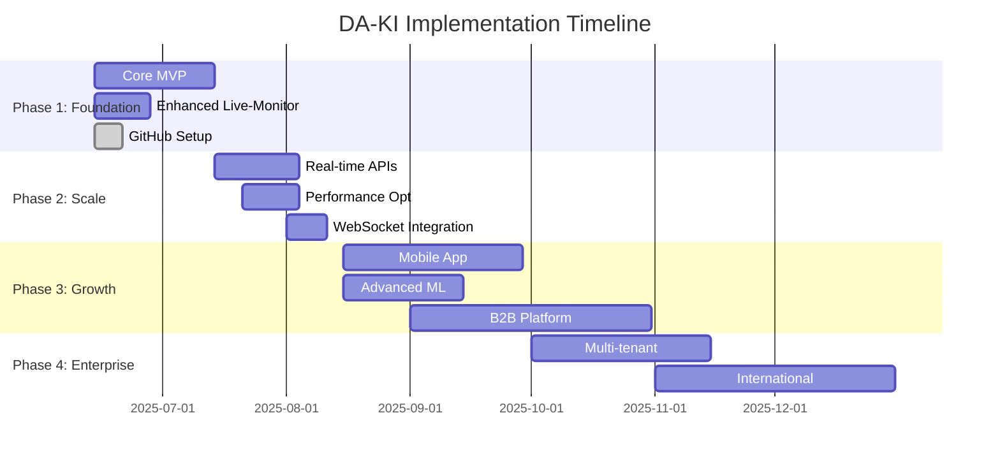

# 🗓️ DA-KI Implementation Roadmap

## 📋 Strategische Entwicklungsplanung

**Strukturierte Umsetzung des DA-KI Projekts in klar definierten Phasen mit messbaren Meilensteinen.**

### 🎯 Roadmap-Übersicht



---

## 🚀 Phase 1: Foundation & MVP (Q2 2025)

### ✅ **Bereits Abgeschlossen**

#### Grundlagen (Woche 1-2)
- [x] **Core KI-Algorithmus** - 5-Faktor Scoring System implementiert
- [x] **Basic Dashboard** - Dash Frontend mit 3 Hauptbereichen
- [x] **Enhanced Live-Monitoring** - Position Selection Modal
- [x] **API Infrastructure** - FastAPI Backend mit 8+ Endpoints
- [x] **Database Setup** - SQLite mit Live-Monitoring Tables
- [x] **GitHub Management** - Vollständige Projektdokumentation

#### Aktuelle Capabilities
```yaml
Funktional:
  - KI-Wachstumsprognose: ✅ 467 deutsche Aktien
  - Live-Monitoring: ✅ Position Tracking mit P&L
  - Portfolio-Simulation: ✅ Basic Implementation
  - API Integration: ✅ RESTful Endpoints
  
Technisch:
  - Frontend: ✅ Dash 2.18+ mit React Components
  - Backend: ✅ FastAPI 0.115+ mit AsyncIO
  - Database: ✅ SQLite mit Migration-Ready Schema
  - Documentation: ✅ Professional GitHub Setup
```

### 🎯 **Phase 1 Verbleibende Aufgaben** (2-3 Wochen)

#### Woche 3: Real-time Integration
```yaml
Sprint 3.1: Yahoo Finance API Integration
  Aufgaben:
    - Yahoo Finance API Client implementieren
    - Error Handling & Rate Limiting
    - Fallback auf Alpha Vantage API
    - Unit Tests für API Clients
  
  Deliverables:
    - services/external_apis/yahoo_finance.py
    - Automated API failover logic
    - Real-time price updates every 60s
  
  Success Criteria:
    - 99.5% API uptime
    - <2s response time for 467 stocks
    - Graceful fallback bei API Ausfällen

Sprint 3.2: Parallel Processing Implementation
  Aufgaben:
    - AsyncIO für parallele Aktien-Analyse
    - Celery Background Tasks Setup
    - Redis Message Queue Integration
    - Performance Monitoring
  
  Deliverables:
    - Async stock processing pipeline
    - Background task scheduler
    - Performance metrics dashboard
  
  Success Criteria:
    - 467 Stocks in <5 Sekunden verarbeitet
    - CPU Utilization >80%
    - Memory usage <512MB pro Worker
```

#### Woche 4: Performance & Caching
```yaml
Sprint 4.1: Redis Caching System
  Aufgaben:
    - Multi-Level Caching Implementation
    - Cache Invalidation Strategy
    - Performance Benchmarking
    - Cache Hit Rate Monitoring
  
  Deliverables:
    - L1/L2/L3 Cache Architecture
    - Automated cache warming
    - Cache performance dashboard
  
  Success Criteria:
    - 90%+ Cache Hit Rate
    - <100ms cached response time
    - 70% reduction in database load

Sprint 4.2: WebSocket Real-time Updates
  Aufgaben:
    - WebSocket Server Implementation
    - Real-time Price Broadcasting
    - Connection Management
    - Frontend WebSocket Client
  
  Deliverables:
    - Live price updates ohne Refresh
    - Real-time Portfolio P&L updates
    - Connection resilience
  
  Success Criteria:
    - <50ms update latency
    - 1000+ concurrent connections
    - 99.9% message delivery rate
```

### 📊 **Phase 1 Success Metrics**

| Metrik | Target | Aktuell | Status |
|--------|--------|---------|---------|
| **API Response Time** | <200ms | ~500ms | 🟡 In Progress |
| **Score Calculation** | <5s (467 stocks) | ~15s | 🟡 Needs Optimization |
| **Cache Hit Rate** | >90% | 0% (No Cache) | 🔴 Pending |
| **Real-time Updates** | <60s | Manual Refresh | 🔴 Pending |
| **Concurrent Users** | 100+ | 1 (Dev) | 🔴 Testing Needed |

---

## ⚡ Phase 2: Scale & Performance (Q3 2025)

### 🎯 **Ziele**
- **Performance**: 10x Verbesserung der Response Times
- **Skalierung**: 1000+ gleichzeitige Nutzer
- **Verfügbarkeit**: 99.9% Uptime
- **Features**: Advanced Portfolio Management

### 📅 **Sprint Planning (6 Sprints à 2 Wochen)**

#### Sprint 5-6: Infrastructure Scaling (Wochen 5-8)
```yaml
Sprint 5: Database Migration & Optimization
  Aufgaben:
    - SQLite → PostgreSQL Migration
    - Database Indexing & Query Optimization
    - Connection Pooling Implementation
    - Database Monitoring Setup
  
  Technical Tasks:
    - Alembic Migration Scripts
    - SQLAlchemy Async Support
    - Database Sharding Strategy
    - Backup & Recovery Procedures
  
  Success Criteria:
    - <100ms average query time
    - 500+ concurrent connections
    - Zero data loss during migration

Sprint 6: Container Orchestration
  Aufgaben:
    - Docker Production Images
    - Kubernetes Deployment
    - Auto-scaling Configuration
    - Health Checks & Monitoring
  
  Technical Tasks:
    - Multi-stage Docker builds
    - K8s manifests (Deployment, Service, Ingress)
    - Horizontal Pod Autoscaler
    - Prometheus metrics integration
  
  Success Criteria:
    - Auto-scaling bei 70% CPU
    - <30s deployment time
    - Zero-downtime deployments
```

#### Sprint 7-8: Advanced Features (Wochen 9-12)
```yaml
Sprint 7: Machine Learning Pipeline
  Aufgaben:
    - ML Model Training Pipeline
    - Feature Engineering Automation
    - Model Performance Tracking
    - A/B Testing Framework
  
  Technical Tasks:
    - MLflow für Model Management
    - Automated retraining pipeline
    - Feature store implementation
    - Model serving API
  
  Success Criteria:
    - >70% prediction accuracy
    - Daily model retraining
    - Automated feature updates

Sprint 8: Advanced Portfolio Management
  Aufgaben:
    - Risk Assessment Engine
    - Portfolio Optimization Algorithms
    - Automated Rebalancing
    - Performance Attribution
  
  Technical Tasks:
    - Modern Portfolio Theory implementation
    - Risk metrics calculation
    - Optimization algorithms (scipy)
    - Portfolio analytics dashboard
  
  Success Criteria:
    - Sharpe Ratio >1.5 für optimierte Portfolios
    - Risk metrics real-time calculation
    - Automated rebalancing suggestions
```

#### Sprint 9-10: Mobile & API Platform (Wochen 13-16)
```yaml
Sprint 9: Mobile App Development
  Aufgaben:
    - React Native App Setup
    - Mobile-optimierte UI/UX
    - Push Notifications
    - Offline Capability
  
  Technical Tasks:
    - React Native + TypeScript
    - Redux state management
    - Firebase push notifications
    - SQLite local storage
  
  Success Criteria:
    - iOS/Android App Store ready
    - <3s app startup time
    - 95%+ crash-free sessions

Sprint 10: B2B API Platform
  Aufgaben:
    - API Gateway Implementation
    - Authentication & Authorization
    - Rate Limiting & Quotas
    - Developer Portal
  
  Technical Tasks:
    - Kong API Gateway
    - JWT + OAuth2 authentication
    - API key management
    - OpenAPI documentation portal
  
  Success Criteria:
    - 99.99% API availability
    - <100ms API gateway latency
    - Self-service developer onboarding
```

### 📈 **Phase 2 Success Metrics**

| Category | Metric | Target | Measurement |
|----------|--------|---------|-------------|
| **Performance** | API Response Time | <100ms | P95 latency |
| **Performance** | Score Calculation | <2s (467 stocks) | End-to-end time |
| **Scalability** | Concurrent Users | 1000+ | Load testing |
| **Reliability** | System Uptime | 99.9% | Monthly availability |
| **Business** | Active Users | 500+ | Weekly active users |
| **Business** | API Customers | 5+ | B2B partnerships |

---

## 🌟 Phase 3: Growth & Expansion (Q4 2025)

### 🎯 **Ziele**
- **Markt**: DACH-Region Expansion
- **Nutzer**: 5000+ aktive Nutzer
- **Revenue**: 50K€ MRR
- **Platform**: White-Label Solutions

### 📅 **Sprint Planning (6 Sprints à 2 Wochen)**

#### Sprint 11-12: Internationalisierung (Wochen 17-20)
```yaml
Sprint 11: Multi-Market Support
  Aufgaben:
    - Österreichische & Schweizer Aktien
    - Multi-Currency Support
    - Lokalisierung (DE/AT/CH)
    - Compliance & Regulierung
  
  Technical Tasks:
    - ATX & SMI Index Integration
    - Currency conversion APIs
    - i18n framework implementation
    - GDPR compliance framework
  
  Success Criteria:
    - 200+ österreichische Aktien
    - 180+ schweizer Aktien
    - Multi-currency P&L calculation

Sprint 12: Advanced Analytics
  Aufgaben:
    - Sector Analysis Dashboard
    - Correlation & Risk Analytics
    - ESG Scoring Integration
    - Custom Alerts System
  
  Technical Tasks:
    - Sector correlation matrices
    - VaR & beta calculations
    - ESG data providers integration
    - Real-time alerting system
  
  Success Criteria:
    - 15+ sector categories
    - Real-time risk metrics
    - ESG scores für 90% der Aktien
```

#### Sprint 13-14: Enterprise Features (Wochen 21-24)
```yaml
Sprint 13: Multi-Tenant Architecture
  Aufgaben:
    - Tenant Isolation Implementation
    - White-Label Customization
    - Enterprise Admin Panel
    - Usage Analytics & Billing
  
  Technical Tasks:
    - Database multi-tenancy
    - Configurable UI themes
    - Admin dashboard development
    - Usage tracking & metering
  
  Success Criteria:
    - 99.99% tenant isolation
    - Custom branding für enterprise
    - Automated billing system

Sprint 14: Integration Platform
  Aufgaben:
    - Webhook System
    - Third-party Integrations
    - Data Export APIs
    - Partner SDK Development
  
  Technical Tasks:
    - Webhook delivery system
    - Zapier/Make.com connectors
    - CSV/Excel export APIs
    - Python/JavaScript SDKs
  
  Success Criteria:
    - 99.9% webhook delivery rate
    - 5+ third-party integrations
    - SDK adoption by 3+ partners
```

#### Sprint 15-16: AI Enhancement (Wochen 25-28)
```yaml
Sprint 15: Advanced ML Models
  Aufgaben:
    - Deep Learning Models
    - Sentiment Analysis Enhancement
    - Anomaly Detection
    - Predictive Alerts
  
  Technical Tasks:
    - LSTM/Transformer models
    - NLP sentiment pipeline
    - Statistical anomaly detection
    - ML-based alert triggers
  
  Success Criteria:
    - >75% prediction accuracy
    - Real-time anomaly detection
    - Reduced false positive alerts

Sprint 16: Automation & Intelligence
  Aufgaben:
    - Automated Trading Signals
    - Smart Portfolio Rebalancing
    - Risk Management Automation
    - AI-Powered Insights
  
  Technical Tasks:
    - Trading signal generation
    - Automated rebalancing engine
    - Risk limit enforcement
    - Natural language insights
  
  Success Criteria:
    - 60%+ profitable signals
    - Automated risk management
    - Human-readable AI insights
```

### 📊 **Phase 3 Success Metrics**

| Category | Metric | Target | Timeline |
|----------|--------|---------|----------|
| **Market** | DACH Stock Coverage | 800+ Aktien | Month 6 |
| **Users** | Monthly Active Users | 5000+ | Month 6 |
| **Revenue** | Monthly Recurring Revenue | 50K€ | Month 6 |
| **Enterprise** | White-Label Customers | 3+ | Month 4 |
| **Technology** | ML Model Accuracy | 75%+ | Month 5 |
| **Platform** | API Partners | 10+ | Month 6 |

---

## 🏢 Phase 4: Enterprise & Global (2026)

### 🎯 **Ziele**
- **Global**: UK/US Märkte
- **Enterprise**: Fortune 500 Kunden
- **Platform**: Ecosystem Leader
- **Funding**: Series A (5-10M€)

### 📅 **Quartalsziele 2026**

#### Q1 2026: Global Expansion
```yaml
Scope: International Markets
  Markets:
    - London Stock Exchange (LSE)
    - NASDAQ & NYSE Integration
    - European Markets (FR, IT, ES)
  
  Technical Challenges:
    - Multi-timezone trading hours
    - Different market data formats
    - Regulatory compliance (SEC, FCA)
    - Currency hedging algorithms
  
  Success Criteria:
    - 2000+ US stocks coverage
    - 500+ UK stocks coverage
    - Multi-timezone real-time updates
```

#### Q2 2026: Enterprise Platform
```yaml
Scope: Enterprise-Grade Features
  Features:
    - SSO & Active Directory integration
    - Advanced compliance reporting
    - Custom SLA agreements
    - Dedicated support teams
  
  Technical Requirements:
    - SAML/OIDC authentication
    - Audit trail & compliance logs
    - SLA monitoring & alerting
    - Multi-region deployments
  
  Success Criteria:
    - 10+ enterprise customers
    - 99.99% SLA compliance
    - SOC2 Type II certification
```

#### Q3 2026: AI Innovation
```yaml
Scope: Next-Generation AI
  Innovations:
    - GPT-powered market analysis
    - Computer vision for chart analysis
    - Reinforcement learning trading
    - Explainable AI decisions
  
  Technical Breakthroughs:
    - Large language model fine-tuning
    - Computer vision CNN models
    - RL trading environments
    - SHAP/LIME explainability
  
  Success Criteria:
    - 80%+ prediction accuracy
    - Human-level chart analysis
    - Explainable trading decisions
```

#### Q4 2026: Ecosystem Leadership
```yaml
Scope: Market Leadership
  Platform:
    - 100+ API partners
    - Developer marketplace
    - Open-source initiatives
    - Industry standards contribution
  
  Community:
    - Developer conferences
    - Educational content
    - Research publications
    - Open-source frameworks
  
  Success Criteria:
    - Top 3 FinTech API platform
    - 1000+ developers in ecosystem
    - Industry thought leadership
```

---

## 📊 Implementation Governance

### 🎯 **Sprint Management Framework**

#### Sprint Structure (2-Wochen-Sprints)
```yaml
Sprint Planning (Montag Woche 1):
  - Sprint Goal Definition
  - User Story Estimation
  - Capacity Planning
  - Risk Assessment

Daily Standups (Täglich 9:00):
  - Yesterday's progress
  - Today's plan
  - Blockers & dependencies
  - Sprint goal alignment

Sprint Review (Freitag Woche 2):
  - Demo & stakeholder feedback
  - Acceptance criteria validation
  - Performance metrics review
  - Next sprint preparation

Sprint Retrospective (Freitag Woche 2):
  - What went well
  - What could improve
  - Action items for next sprint
  - Process optimizations
```

#### Quality Gates
```yaml
Definition of Done:
  Code Quality:
    - 90%+ test coverage
    - All CI/CD checks pass
    - Code review approved
    - Security scan clean
  
  Performance:
    - Load testing passed
    - Performance targets met
    - Memory leaks checked
    - Scalability validated
  
  Documentation:
    - API documentation updated
    - User guides written
    - Technical specs current
    - Deployment guides ready
```

### 📈 **Success Tracking & KPIs**

#### Weekly Metrics Review
```yaml
Technical KPIs:
  - Sprint velocity (story points)
  - Bug escape rate (<5%)
  - Code coverage (>90%)
  - Deployment frequency (daily)
  - MTTR (<1 hour)

Business KPIs:
  - Weekly active users
  - API requests per day
  - Customer satisfaction (NPS)
  - Revenue growth rate
  - Churn rate (<5% monthly)

Product KPIs:
  - Feature adoption rate
  - User engagement metrics
  - Performance benchmarks
  - Error rates (<0.1%)
  - Uptime (>99.9%)
```

#### Monthly OKR Review
```yaml
Objectives & Key Results (OKR) Framework:
  
  Objective: "Deliver exceptional user experience"
  Key Results:
    - NPS score >70
    - App crash rate <0.1%
    - Support ticket resolution <24h
  
  Objective: "Scale platform infrastructure"
  Key Results:
    - Support 10k concurrent users
    - API response time <100ms
    - 99.99% uptime achievement
  
  Objective: "Accelerate business growth"
  Key Results:
    - 100% MRR growth QoQ
    - 5+ new enterprise customers
    - 20+ API partnerships
```

### 🔄 **Risk Management & Mitigation**

#### Technical Risks
| Risk | Probability | Impact | Mitigation Strategy |
|------|-------------|---------|-------------------|
| **API Rate Limits** | High | Medium | Multiple provider fallbacks |
| **Scalability Issues** | Medium | High | Gradual load testing & optimization |
| **Data Quality** | Medium | High | Multi-source validation & monitoring |
| **Security Breach** | Low | High | Security audits & penetration testing |

#### Business Risks
| Risk | Probability | Impact | Mitigation Strategy |
|------|-------------|---------|-------------------|
| **Market Competition** | High | Medium | Unique value proposition & innovation |
| **Regulatory Changes** | Medium | High | Legal compliance monitoring |
| **Key Person Risk** | Medium | Medium | Knowledge documentation & cross-training |
| **Funding Shortfall** | Low | High | Revenue diversification & bootstrapping |

#### Operational Risks
| Risk | Probability | Impact | Mitigation Strategy |
|------|-------------|---------|-------------------|
| **Team Scaling** | Medium | Medium | Structured hiring & onboarding |
| **Technical Debt** | High | Medium | Regular refactoring sprints |
| **Third-party Dependencies** | Medium | Medium | Vendor diversification |
| **Customer Support** | Medium | Low | Automated support & documentation |

---

## 🎯 **Nächste Schritte (Immediate Actions)**

### 🚨 **Priorität 1: Diese Woche**
1. **Real-time API Integration** - Yahoo Finance Implementation
2. **Parallel Processing** - AsyncIO für 467 Aktien
3. **Performance Baseline** - Current metrics dokumentieren

### ⚡ **Priorität 2: Nächste 2 Wochen**
1. **Redis Caching System** - Multi-Level Implementation
2. **WebSocket Integration** - Real-time Updates
3. **Load Testing Setup** - Performance Validierung

### 📈 **Priorität 3: Nächster Monat**
1. **Database Migration** - SQLite → PostgreSQL
2. **Container Deployment** - Kubernetes Setup
3. **Monitoring Dashboard** - Prometheus + Grafana

---

**🗓️ Implementation Roadmap | Version 1.0 | DA-KI Project**

*Entwickelt mit [Claude Code](https://claude.ai/code) - Strategische Softwareentwicklung & Projektmanagement*