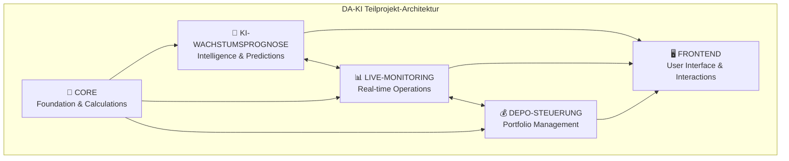
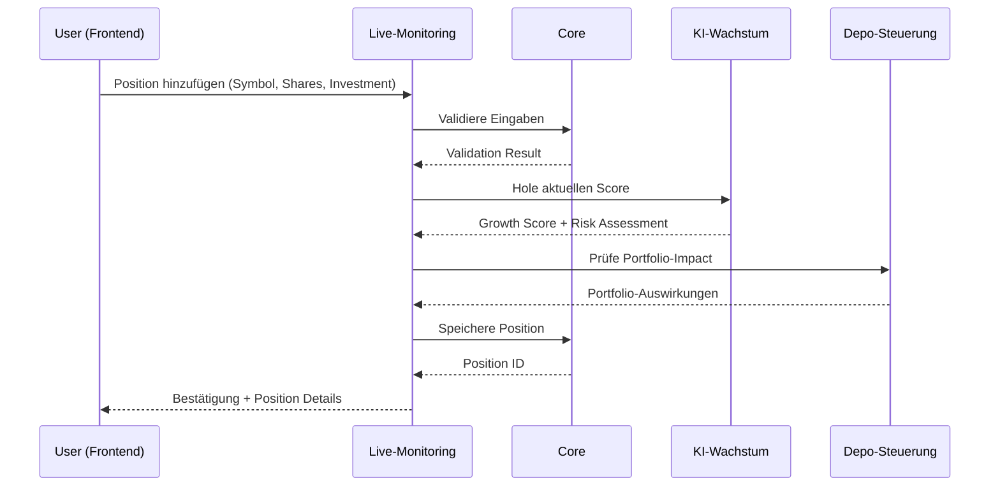

# 🎯 DA-KI Teilprojekt-Definition & Abgrenzung

## 📋 Übersicht der Teilprojekte

Das DA-KI Projekt ist in **5 klar abgegrenzte Teilprojekte** strukturiert, die sowohl unabhängig entwickelt als auch nahtlos integriert werden können.



---

## 🧠 TEILPROJEKT 1: CORE (Foundation & Calculations)

### 🎯 **Zweck & Verantwortlichkeiten**
**"Fundament aller Berechnungen und Datenverarbeitung"**

Das CORE-Teilprojekt stellt die grundlegenden Berechnungsmodule, Datenstrukturen und Utility-Funktionen bereit, die von allen anderen Teilprojekten verwendet werden.

### 📁 **Dateistruktur & Komponenten**
```
services/
├── growth_prediction_top10.py     # Haupt-Berechnungslogik ✅
├── data_manager.py                 # Datenverarbeitung & Validierung
├── calculation_engine.py           # Kern-Berechnungsalgorithmen
├── market_data_processor.py        # Marktdaten-Verarbeitung
├── scoring_algorithms.py           # Bewertungsalgorithmen
└── utils/
    ├── __init__.py
    ├── validators.py               # Eingabe-Validierung
    ├── formatters.py              # Datenformatierung
    ├── constants.py               # Konstanten & Konfiguration
    └── exceptions.py              # Custom Exceptions
```

### 🔧 **Kernfunktionalitäten**

#### 1. Basis-Berechnungsmodule
```python
# Core Calculation Interface
class CoreCalculationEngine:
    """Zentrale Berechnungs-Engine für alle Teilprojekte"""
    
    def calculate_growth_score(self, stock_data: Dict) -> float:
        """5-Faktor Scoring Algorithmus"""
        pass
    
    def calculate_risk_metrics(self, portfolio_data: Dict) -> Dict:
        """Risiko-Kennzahlen Berechnung"""
        pass
    
    def normalize_stock_data(self, raw_data: Dict) -> Dict:
        """Standardisierung von Aktiendaten"""
        pass
    
    def validate_market_data(self, data: Dict) -> bool:
        """Marktdaten-Validierung"""
        pass
```

#### 2. Datenmanagement
```python
# Data Management Core
class DataManager:
    """Zentrale Datenverarbeitung und -validierung"""
    
    def fetch_stock_fundamentals(self, symbol: str) -> Dict:
        """Fundamentaldaten abrufen und verarbeiten"""
        pass
    
    def calculate_technical_indicators(self, price_data: List) -> Dict:
        """Technische Indikatoren berechnen"""
        pass
    
    def aggregate_sector_data(self, symbols: List[str]) -> Dict:
        """Sektordaten aggregieren"""
        pass
```

### 📊 **Input/Output Definitionen**

#### Standard-Datenstrukturen
```python
# Standardisierte Datenmodelle
@dataclass
class StockData:
    symbol: str
    name: str
    current_price: float
    market_cap: float
    pe_ratio: Optional[float]
    sector: str
    timestamp: datetime

@dataclass
class ScoreComponents:
    performance_score: float    # 0-100
    fundamental_score: float    # 0-100
    sentiment_score: float      # 0-100
    sector_score: float        # 0-100
    momentum_score: float      # 0-100
    final_score: float         # 0-100
```

### 🔗 **Schnittstellen zu anderen Teilprojekten**

| Teilprojekt | Interface | Datenformat |
|-------------|-----------|-------------|
| **KI-WACHSTUMSPROGNOSE** | `get_stock_score()` | `ScoreComponents` |
| **LIVE-MONITORING** | `calculate_position_metrics()` | `PositionMetrics` |
| **DEPO-STEUERUNG** | `optimize_portfolio()` | `PortfolioOptimization` |
| **FRONTEND** | Keine direkten Calls | Über andere Teilprojekte |

### ✅ **Aktueller Status & Deliverables**
- [x] **Basis-Algorithmus implementiert** - `growth_prediction_top10.py`
- [ ] **Data Manager Refactoring** - Modulare Datenverarbeitung
- [ ] **Utility Functions** - Validierung & Formatierung
- [ ] **Unit Tests** - 90%+ Coverage für Core Functions
- [ ] **Performance Optimization** - Sub-second Berechnungen

---

## 🖥️ TEILPROJEKT 2: FRONTEND (User Interface & Interactions)

### 🎯 **Zweck & Verantwortlichkeiten**
**"Darstellung der Daten vom Backend und Interaktion mit dem Anwender"**

Das FRONTEND-Teilprojekt ist zuständig für:
- **Darstellung der Daten** vom Backend in benutzerfreundlicher Form
- **Interaktion mit dem Anwender** durch intuitive Bedienelemente
- **Keine Business Logic** - nur Präsentation und User Interface

### 📁 **Dateistruktur & Komponenten**
```
frontend/
├── dashboard_top10.py              # Haupt-Dashboard ✅
├── components/
│   ├── __init__.py
│   ├── growth_cards.py            # Wachstums-Aktien Karten
│   ├── monitoring_table.py        # Live-Monitoring Tabelle
│   ├── portfolio_simulator.py     # Portfolio-Simulation
│   ├── modals.py                  # Modal-Dialoge ✅
│   └── charts.py                  # Chart-Komponenten
├── layouts/
│   ├── __init__.py
│   ├── header.py                  # Navigation & Header
│   ├── sidebar.py                 # Seitennavigation
│   └── footer.py                  # Footer-Komponenten
├── assets/
│   ├── style.css                  # Custom CSS
│   ├── favicon.ico                # App Icon
│   └── images/                    # Statische Bilder
└── utils/
    ├── __init__.py
    ├── dash_helpers.py            # Dash Utility Functions
    ├── formatters.py              # UI Formatierung
    └── validators.py              # Frontend Validierung
```

### 🔧 **Kernfunktionalitäten**

#### 1. Daten-Darstellung (Data Presentation)
```python
# Data Presentation Components
class DataPresentation:
    """Darstellung von Backend-Daten"""
    
    def render_stock_data(self, stock_data: Dict) -> html.Div:
        """Zeigt Aktiendaten vom Backend an"""
        pass
    
    def render_portfolio_metrics(self, metrics: Dict) -> html.Div:
        """Zeigt Portfolio-Kennzahlen an"""
        pass
    
    def render_live_prices(self, price_data: Dict) -> html.Div:
        """Zeigt Live-Preise vom Backend an"""
        pass
    
    def format_financial_data(self, data: Dict) -> str:
        """Formatiert Finanzdaten für Anzeige"""
        pass
```

#### 2. Anwender-Interaktion (User Interaction)
```python
# User Interaction Components
class UserInteraction:
    """Anwender-Interaktion und Input-Handling"""
    
    def handle_button_clicks(self, button_id: str, n_clicks: int):
        """Behandelt Button-Klicks und sendet Requests an Backend"""
        pass
    
    def handle_form_submission(self, form_data: Dict):
        """Behandelt Formular-Eingaben und Validierung"""
        pass
    
    def handle_modal_interactions(self, modal_inputs: Dict):
        """Behandelt Modal-Dialog Interaktionen ✅"""
        pass
    
    def send_api_request(self, endpoint: str, data: Dict) -> Dict:
        """Sendet Requests an Backend und empfängt Antworten"""
        pass
```

### 📱 **UI/UX Komponenten**

#### Responsive Design Framework
```css
/* Mobile-First Responsive Design */
.container {
    max-width: 1200px;
    margin: 0 auto;
    padding: 20px;
}

@media (max-width: 768px) {
    .stock-card {
        width: 100%;
        margin-bottom: 15px;
    }
}

@media (min-width: 769px) {
    .stock-card {
        width: 48%;
        display: inline-block;
    }
}
```

#### Theme & Styling
```python
# DA-KI Design System
THEME_CONFIG = {
    'primary_color': '#2c3e50',      # Dark Blue
    'secondary_color': '#27ae60',     # Green (Success)
    'accent_color': '#f39c12',        # Orange (Warning)
    'danger_color': '#e74c3c',        # Red (Error)
    'background_color': '#ecf0f1',    # Light Gray
    'text_color': '#2c3e50',          # Dark Blue
    'font_family': 'Inter, sans-serif'
}
```

### 🔗 **Schnittstellen zu anderen Teilprojekten**

**Frontend = Reine Präsentationsschicht**

| Backend-Teilprojekt | Datenfluss | Frontend-Aufgabe |
|---------------------|------------|------------------|
| **KI-WACHSTUMSPROGNOSE** | Backend → Frontend | Empfängt Scores & zeigt sie an |
| **LIVE-MONITORING** | Backend ↔ Frontend | Empfängt Updates & sendet Position-Requests |
| **DEPO-STEUERUNG** | Backend ↔ Frontend | Empfängt Portfolio-Daten & sendet User-Input |
| **CORE** | Keine direkte Verbindung | Über andere Backend-Teilprojekte |

**Klare Trennung:**
- **Frontend**: Nur Darstellung + User Input
- **Backend**: Alle Business Logic + Datenverarbeitung

### ✅ **Aktueller Status & Deliverables**
- [x] **Basis-Dashboard implementiert** - 3 Hauptsektionen
- [x] **Enhanced Button Integration** - Position Selection Modal
- [ ] **Component Refactoring** - Modulare UI-Komponenten
- [ ] **Responsive Design** - Mobile Optimization
- [ ] **Accessibility** - WCAG 2.1 Compliance
- [ ] **Performance** - Lazy Loading & Optimization

---

## 🤖 TEILPROJEKT 3: KI-WACHSTUMSPROGNOSE (Intelligence & Predictions)

### 🎯 **Zweck & Verantwortlichkeiten**
**"Künstliche Intelligenz für Aktienanalyse und Wachstumsprognosen"**

Das KI-WACHSTUMSPROGNOSE-Teilprojekt implementiert alle Machine Learning Algorithmen, Prognosemodelle und KI-gestützte Analysen.

### 📁 **Dateistruktur & Komponenten**
```
services/
├── ki_models/
│   ├── __init__.py
│   ├── growth_predictor.py         # Haupt-KI Modul ✅
│   ├── ensemble_models.py          # Ensemble Learning
│   ├── feature_engineering.py     # Feature Engineering
│   ├── model_training.py          # Training Pipeline
│   └── model_evaluation.py        # Model Validation
├── ml_pipeline/
│   ├── __init__.py
│   ├── data_preparation.py        # Datenaufbereitung
│   ├── feature_selection.py       # Feature Selection
│   ├── hyperparameter_tuning.py   # Hyperparameter Optimization
│   └── model_serving.py           # Model Serving
└── analytics/
    ├── __init__.py
    ├── sentiment_analysis.py       # News & Social Sentiment
    ├── technical_analysis.py       # Technische Indikatoren
    ├── fundamental_analysis.py     # Fundamentalanalyse
    └── sector_analysis.py          # Sektoranalyse
```

### 🔧 **Kernfunktionalitäten**

#### 1. 5-Faktor Scoring System
```python
# KI-basiertes Scoring System
class GrowthPredictor:
    """Haupt-KI Modul für Wachstumsprognosen"""
    
    def __init__(self):
        self.models = {
            'performance_model': None,
            'fundamental_model': None,
            'sentiment_model': None,
            'sector_model': None,
            'momentum_model': None
        }
        self.ensemble_weights = {
            'performance': 0.30,
            'fundamental': 0.25,
            'sentiment': 0.20,
            'sector': 0.15,
            'momentum': 0.10
        }
    
    def calculate_growth_score(self, stock_data: Dict) -> float:
        """Berechnet finalen Wachstums-Score (0-100)"""
        pass
    
    def predict_price_target(self, symbol: str, days: int = 30) -> Dict:
        """30-Tage Kursprognose mit Konfidenzintervall"""
        pass
    
    def analyze_risk_profile(self, stock_data: Dict) -> Dict:
        """Risikoprofil-Analyse"""
        pass
```

#### 2. Machine Learning Pipeline
```python
# ML Training & Inference Pipeline
class MLPipeline:
    """Machine Learning Pipeline Management"""
    
    def train_ensemble_models(self, training_data: pd.DataFrame):
        """Trainiert alle Ensemble-Modelle"""
        pass
    
    def validate_model_performance(self, test_data: pd.DataFrame) -> Dict:
        """Validiert Modell-Performance"""
        pass
    
    def retrain_models(self, new_data: pd.DataFrame):
        """Automatisches Model Retraining"""
        pass
    
    def get_feature_importance(self) -> Dict:
        """Feature Importance Analysis"""
        pass
```

### 📊 **KI-Algorithmus Details**

#### Performance Faktor (30% Gewichtung)
```python
def calculate_performance_score(self, stock_data: Dict) -> float:
    """
    Berechnet Performance-Score basierend auf:
    - 1-Jahres-Rendite (40%)
    - Volatilität (30%)
    - Sharpe Ratio (20%)
    - Maximum Drawdown (10%)
    """
    return score  # 0-100
```

#### Fundamental Faktor (25% Gewichtung)
```python
def calculate_fundamental_score(self, stock_data: Dict) -> float:
    """
    Berechnet Fundamental-Score basierend auf:
    - P/E Ratio (30%)
    - P/B Ratio (25%)
    - Debt/Equity (20%)
    - ROE (15%)
    - Revenue Growth (10%)
    """
    return score  # 0-100
```

#### Sentiment Faktor (20% Gewichtung)
```python
def calculate_sentiment_score(self, symbol: str) -> float:
    """
    Berechnet Sentiment-Score basierend auf:
    - News Sentiment (50%)
    - Social Media Sentiment (30%)
    - Analyst Ratings (20%)
    """
    return score  # 0-100
```

### 🧠 **Machine Learning Modelle**

| Modell-Typ | Algorithmus | Verwendung | Performance Ziel |
|------------|-------------|------------|------------------|
| **Regression** | XGBoost | Preisprognose | R² > 0.70 |
| **Classification** | Random Forest | Trend-Richtung | Accuracy > 75% |
| **Time Series** | LSTM | Zeitreihenprognose | MAPE < 15% |
| **Ensemble** | Voting Classifier | Final Prediction | Combined Accuracy > 80% |

### 🔗 **Schnittstellen zu anderen Teilprojekten**

| Teilprojekt | Datenfluss | Interface |
|-------------|------------|-----------|
| **CORE** | Empfängt Basis-Berechnungen | `CoreCalculationEngine` |
| **LIVE-MONITORING** | Liefert Real-time Scores | `get_live_scores()` |
| **DEPO-STEUERUNG** | Optimierungsempfehlungen | `get_portfolio_recommendations()` |
| **FRONTEND** | Score-Visualisierung | API Endpoints |

### ✅ **Aktueller Status & Deliverables**
- [x] **Basis-Scoring implementiert** - 5-Faktor System ✅
- [ ] **ML Pipeline Setup** - Training & Inference
- [ ] **Feature Engineering** - Erweiterte Features
- [ ] **Model Validation** - Backtesting Framework
- [ ] **Real-time Inference** - Live Score Updates

---

## 📊 TEILPROJEKT 4: LIVE-MONITORING (Real-time Operations)

### 🎯 **Zweck & Verantwortlichkeiten**
**"Echtzeit-Überwachung und Position-Management"**

Das LIVE-MONITORING-Teilprojekt verwaltet alle Echtzeit-Funktionen, Position-Tracking und Live-Updates der Anwendung.

### 📁 **Dateistruktur & Komponenten**
```
services/
├── live_monitoring/
│   ├── __init__.py
│   ├── position_manager.py         # Position-Verwaltung ✅
│   ├── real_time_updater.py       # Real-time Updates
│   ├── alert_system.py            # Benachrichtigungen
│   ├── performance_tracker.py     # Performance-Tracking
│   └── risk_monitor.py            # Risiko-Überwachung
├── websocket/
│   ├── __init__.py
│   ├── websocket_manager.py       # WebSocket Server
│   ├── connection_handler.py      # Connection Management
│   └── message_broker.py          # Message Broadcasting
├── external_apis/
│   ├── __init__.py
│   ├── yahoo_finance.py           # Yahoo Finance Integration
│   ├── alpha_vantage.py           # Alpha Vantage Backup
│   ├── market_data_client.py      # Unified API Client
│   └── api_rate_limiter.py        # Rate Limiting
└── background_tasks/
    ├── __init__.py
    ├── price_updater.py           # Preis-Updates
    ├── score_calculator.py        # Score-Berechnung
    └── alert_processor.py         # Alert-Verarbeitung
```

### 🔧 **Kernfunktionalitäten**

#### 1. Position Management
```python
# Position Management System
class PositionManager:
    """Verwaltet alle Live-Monitoring Positionen"""
    
    def add_position(self, user_id: str, stock_data: Dict) -> Dict:
        """Neue Position hinzufügen ✅"""
        pass
    
    def update_position_values(self, position_id: int) -> Dict:
        """Position-Werte aktualisieren"""
        pass
    
    def calculate_pnl(self, position_id: int) -> Dict:
        """Profit & Loss Berechnung"""
        pass
    
    def set_alerts(self, position_id: int, alerts: Dict) -> bool:
        """Stop-Loss & Take-Profit setzen"""
        pass
```

#### 2. Real-time Data Processing
```python
# Real-time Update Engine
class RealTimeUpdater:
    """Echtzeit-Datenverarbeitung"""
    
    def __init__(self):
        self.update_interval = 60  # Sekunden
        self.active_symbols = set()
        self.websocket_manager = WebSocketManager()
    
    async def start_monitoring(self, symbols: List[str]):
        """Startet Echtzeit-Monitoring"""
        pass
    
    async def process_price_update(self, symbol: str, price_data: Dict):
        """Verarbeitet Preis-Updates"""
        pass
    
    async def broadcast_updates(self, update_data: Dict):
        """Sendet Updates an alle Clients"""
        pass
```

#### 3. External API Integration
```python
# External Market Data APIs
class MarketDataClient:
    """Unified Market Data Client"""
    
    def __init__(self):
        self.primary_api = YahooFinanceAPI()
        self.backup_api = AlphaVantageAPI()
        self.rate_limiter = APIRateLimiter()
    
    async def get_real_time_price(self, symbol: str) -> Dict:
        """Aktueller Preis mit Fallback"""
        pass
    
    async def get_historical_data(self, symbol: str, period: str) -> pd.DataFrame:
        """Historische Daten"""
        pass
    
    async def bulk_price_update(self, symbols: List[str]) -> Dict:
        """Bulk-Preis Updates für alle 467 Aktien"""
        pass
```

### ⚡ **Real-time Architecture**

#### WebSocket Implementation
```python
# WebSocket Real-time Updates
class WebSocketManager:
    """WebSocket Connection Management"""
    
    def __init__(self):
        self.active_connections: Set[WebSocket] = set()
        self.user_subscriptions: Dict[str, Set[str]] = {}
    
    async def connect_user(self, websocket: WebSocket, user_id: str):
        """User WebSocket Connection"""
        pass
    
    async def subscribe_to_symbol(self, user_id: str, symbol: str):
        """Symbol-spezifische Subscriptions"""
        pass
    
    async def broadcast_price_update(self, symbol: str, price_data: Dict):
        """Broadcast an alle interessierten Users"""
        pass
```

#### Background Task Scheduler
```python
# Celery Background Tasks
@celery.task(bind=True)
def update_all_stock_prices(self):
    """Aktualisiert alle 467 Aktienpreise"""
    try:
        symbols = get_all_monitored_symbols()
        price_data = market_client.bulk_price_update(symbols)
        
        for symbol, data in price_data.items():
            # Update Database
            update_stock_price_in_db(symbol, data)
            
            # Calculate new scores if needed
            if should_recalculate_score(symbol):
                new_score = calculate_growth_score(symbol)
                update_score_in_cache(symbol, new_score)
            
            # Send WebSocket updates
            broadcast_price_update(symbol, data)
            
    except Exception as exc:
        self.retry(countdown=60, exc=exc)
```

### 📊 **Performance Monitoring**

#### Real-time Metrics
```python
# Live Performance Tracking
class PerformanceTracker:
    """Echtzeit Performance-Überwachung"""
    
    def track_position_performance(self, position_id: int) -> Dict:
        """Position Performance Metrics"""
        return {
            'total_return': 0.15,        # 15% Gewinn
            'daily_pnl': 25.50,          # Tagesgewinn/-verlust
            'unrealized_pnl': 150.75,    # Unrealisierter Gewinn
            'win_rate': 0.68,            # 68% Gewinn-Rate
            'sharpe_ratio': 1.85,        # Risiko-adjustierte Performance
            'max_drawdown': 0.08         # Maximaler Verlust
        }
```

### 🔗 **Schnittstellen zu anderen Teilprojekten**

| Teilprojekt | Datenfluss | Update-Frequenz |
|-------------|------------|----------------|
| **KI-WACHSTUMSPROGNOSE** | Score-Updates | Alle 5 Minuten |
| **DEPO-STEUERUNG** | Portfolio-Werte | Real-time |
| **FRONTEND** | UI-Updates | Live via WebSocket |
| **CORE** | Berechnungsanfragen | On-demand |

### ✅ **Aktueller Status & Deliverables**
- [x] **Position-Management implementiert** - Add/Track Positionen ✅
- [x] **Enhanced Modal Integration** - UI für Position-Auswahl ✅
- [ ] **Yahoo Finance API** - Real-time Preis-Updates
- [ ] **WebSocket Server** - Live Updates an Frontend
- [ ] **Background Tasks** - Automated Price Updates
- [ ] **Alert System** - Stop-Loss & Take-Profit Alerts

---

## 💰 TEILPROJEKT 5: DEPO-STEUERUNG (Portfolio Management)

### 🎯 **Zweck & Verantwortlichkeiten**
**"Portfolio-Optimierung und Asset-Allokation"**

Das DEPO-STEUERUNG-Teilprojekt implementiert alle Portfolio-Management-Funktionen, Optimierungsalgorithmen und Asset-Allokation-Strategien.

### 📁 **Dateistruktur & Komponenten**
```
services/
├── portfolio_management/
│   ├── __init__.py
│   ├── portfolio_optimizer.py      # Portfolio-Optimierung
│   ├── asset_allocator.py         # Asset-Allokation
│   ├── risk_manager.py            # Risiko-Management
│   ├── rebalancer.py              # Portfolio-Rebalancing
│   └── performance_analyzer.py    # Performance-Analyse
├── optimization_algorithms/
│   ├── __init__.py
│   ├── modern_portfolio_theory.py # MPT Implementation
│   ├── black_litterman.py         # Black-Litterman Model
│   ├── risk_parity.py             # Risk Parity Strategy
│   └── genetic_algorithm.py       # Genetic Optimization
├── risk_models/
│   ├── __init__.py
│   ├── var_calculator.py          # Value at Risk
│   ├── correlation_analyzer.py    # Korrelationsanalyse
│   ├── stress_tester.py           # Stress Testing
│   └── scenario_analyzer.py       # Szenario-Analyse
└── backtesting/
    ├── __init__.py
    ├── backtest_engine.py         # Backtesting Framework
    ├── strategy_tester.py         # Strategy Testing
    └── performance_metrics.py     # Performance Kennzahlen
```

### 🔧 **Kernfunktionalitäten**

#### 1. Portfolio Optimization
```python
# Modern Portfolio Theory Implementation
class PortfolioOptimizer:
    """Portfolio-Optimierung nach Markowitz"""
    
    def __init__(self):
        self.optimization_methods = {
            'max_sharpe': self._maximize_sharpe_ratio,
            'min_volatility': self._minimize_volatility,
            'max_return': self._maximize_return,
            'risk_parity': self._risk_parity_allocation
        }
    
    def optimize_portfolio(self, stocks: List[str], method: str = 'max_sharpe') -> Dict:
        """
        Optimiert Portfolio-Allokation
        
        Returns:
            {
                'weights': [0.25, 0.30, 0.20, 0.25],  # Asset-Gewichtungen
                'expected_return': 0.12,               # Erwartete Rendite
                'volatility': 0.08,                    # Portfolio-Volatilität
                'sharpe_ratio': 1.5                    # Sharpe Ratio
            }
        """
        pass
    
    def calculate_efficient_frontier(self, stocks: List[str]) -> pd.DataFrame:
        """Efficient Frontier Berechnung"""
        pass
```

#### 2. Risk Management
```python
# Advanced Risk Management
class RiskManager:
    """Umfassendes Risiko-Management"""
    
    def calculate_var(self, portfolio: Dict, confidence: float = 0.95) -> float:
        """Value at Risk Berechnung"""
        pass
    
    def calculate_expected_shortfall(self, portfolio: Dict) -> float:
        """Expected Shortfall (CVaR)"""
        pass
    
    def analyze_concentration_risk(self, portfolio: Dict) -> Dict:
        """Konzentrations-Risiko Analyse"""
        pass
    
    def stress_test_portfolio(self, portfolio: Dict, scenarios: List[Dict]) -> Dict:
        """Stress Testing unter verschiedenen Szenarien"""
        pass
```

#### 3. Automated Rebalancing
```python
# Portfolio Rebalancing Engine
class PortfolioRebalancer:
    """Automatisches Portfolio-Rebalancing"""
    
    def __init__(self):
        self.rebalancing_triggers = {
            'threshold': 0.05,    # 5% Abweichung
            'time_based': 30,     # 30 Tage
            'volatility': 0.02    # 2% Volatility Change
        }
    
    def check_rebalancing_needed(self, portfolio: Dict) -> bool:
        """Prüft ob Rebalancing erforderlich"""
        pass
    
    def generate_rebalancing_orders(self, current: Dict, target: Dict) -> List[Dict]:
        """Generiert Rebalancing-Orders"""
        pass
    
    def calculate_transaction_costs(self, orders: List[Dict]) -> float:
        """Berechnet Transaktionskosten"""
        pass
```

### 📊 **Portfolio Analytics**

#### Performance Attribution
```python
# Performance Attribution Analysis
class PerformanceAnalyzer:
    """Detaillierte Performance-Analyse"""
    
    def calculate_attribution(self, portfolio: Dict, benchmark: Dict) -> Dict:
        """
        Performance Attribution Analysis
        
        Returns:
            {
                'total_return': 0.15,           # Gesamt-Rendite
                'benchmark_return': 0.12,       # Benchmark-Rendite
                'excess_return': 0.03,          # Überrendite
                'asset_allocation_effect': 0.02, # Asset Allocation Effekt
                'stock_selection_effect': 0.01  # Stock Selection Effekt
            }
        """
        pass
    
    def calculate_risk_metrics(self, portfolio: Dict) -> Dict:
        """Umfassende Risiko-Kennzahlen"""
        return {
            'volatility': 0.08,           # Volatilität
            'beta': 0.95,                 # Beta zum Markt
            'alpha': 0.02,                # Alpha (Überrendite)
            'sharpe_ratio': 1.5,          # Sharpe Ratio
            'information_ratio': 1.2,     # Information Ratio
            'max_drawdown': 0.12,         # Maximaler Drawdown
            'var_95': 0.05,               # VaR 95%
            'expected_shortfall': 0.08    # Expected Shortfall
        }
```

#### Backtesting Framework
```python
# Historical Backtesting
class BacktestEngine:
    """Historisches Backtesting von Strategien"""
    
    def run_backtest(self, strategy: Dict, start_date: str, end_date: str) -> Dict:
        """
        Führt historisches Backtesting durch
        
        Args:
            strategy: Portfolio-Strategie Definition
            start_date: Start-Datum für Backtest
            end_date: End-Datum für Backtest
            
        Returns:
            {
                'total_return': 0.45,        # Gesamt-Rendite
                'annualized_return': 0.12,   # Annualisierte Rendite
                'volatility': 0.08,          # Volatilität
                'sharpe_ratio': 1.5,         # Sharpe Ratio
                'max_drawdown': 0.15,        # Max Drawdown
                'win_rate': 0.68,            # Gewinn-Rate
                'trades': 156                # Anzahl Trades
            }
        """
        pass
```

### 🏆 **Portfolio Strategies**

#### Vordefinierte Strategien
```python
# Portfolio Strategy Templates
PORTFOLIO_STRATEGIES = {
    'conservative': {
        'risk_tolerance': 'low',
        'target_volatility': 0.06,
        'max_single_position': 0.10,
        'sector_limits': 0.15,
        'rebalancing_frequency': 30
    },
    'balanced': {
        'risk_tolerance': 'medium',
        'target_volatility': 0.10,
        'max_single_position': 0.15,
        'sector_limits': 0.20,
        'rebalancing_frequency': 45
    },
    'aggressive': {
        'risk_tolerance': 'high',
        'target_volatility': 0.16,
        'max_single_position': 0.25,
        'sector_limits': 0.30,
        'rebalancing_frequency': 60
    }
}
```

### 🔗 **Schnittstellen zu anderen Teilprojekten**

| Teilprojekt | Interface | Datenfluss |
|-------------|-----------|------------|
| **KI-WACHSTUMSPROGNOSE** | Empfängt Scores | Stock Rankings für Optimierung |
| **LIVE-MONITORING** | Empfängt Positionen | Aktuelle Portfolio-Werte |
| **CORE** | Nutzt Berechnungen | Risk & Return Calculations |
| **FRONTEND** | Liefert UI-Daten | Portfolio-Visualisierungen |

### ✅ **Aktueller Status & Deliverables**
- [x] **Basic Portfolio-Simulation** - Startkapital-Allokation ✅
- [ ] **Modern Portfolio Theory** - Markowitz Optimierung
- [ ] **Risk Management** - VaR & Stress Testing
- [ ] **Backtesting Framework** - Historische Strategien-Tests
- [ ] **Automated Rebalancing** - Dynamic Portfolio Management
- [ ] **Performance Attribution** - Detaillierte Analyse

---

## 🔗 Teilprojekt-Abhängigkeiten & Integration

### 📊 **Abhängigkeitsmatrix**

| Teilprojekt | CORE | FRONTEND | KI-WACHSTUM | LIVE-MONITOR | DEPO-STEUERUNG |
|-------------|------|----------|-------------|--------------|----------------|
| **CORE** | - | ❌ | ⬆️ Provides | ⬆️ Provides | ⬆️ Provides |
| **FRONTEND** | ❌ | - | ⬇️ Consumes | ⬇️ Consumes | ⬇️ Consumes |
| **KI-WACHSTUM** | ⬇️ Depends | ⬆️ Provides | - | ↔️ Bidirectional | ⬆️ Provides |
| **LIVE-MONITOR** | ⬇️ Depends | ⬆️ Provides | ⬇️ Depends | - | ↔️ Bidirectional |
| **DEPO-STEUERUNG** | ⬇️ Depends | ⬆️ Provides | ⬇️ Depends | ⬇️ Depends | - |

### 🔄 **Integration Flow**

#### Datenfluss-Beispiel: Neue Position hinzufügen


### 📋 **Development Guidelines pro Teilprojekt**

#### CORE Development Rules
```yaml
Code Standards:
  - Alle Funktionen müssen type hints haben
  - Unit Tests für alle public methods (>95% coverage)
  - Keine Business Logic in CORE (nur Berechnungen)
  - Immutable Datenstrukturen bevorzugen
  
Performance Requirements:
  - Einzelne Berechnungen <100ms
  - Bulk-Operationen <5s für 467 Aktien
  - Memory usage <256MB pro Prozess
```

#### FRONTEND Development Rules
```yaml
UI/UX Standards:
  - Mobile-first responsive design
  - WCAG 2.1 AA accessibility compliance
  - Loading states für alle async operations
  - Error boundaries für alle Komponenten
  
Performance Requirements:
  - First Paint <2s
  - Time to Interactive <3s
  - Bundle size <2MB gzipped
```

#### KI-WACHSTUMSPROGNOSE Development Rules
```yaml
ML/AI Standards:
  - Reproducible models (fixed random seeds)
  - Model versioning und tracking
  - A/B testing für neue Algorithmen
  - Explainable AI für alle Predictions
  
Performance Requirements:
  - Score Berechnung <500ms pro Aktie
  - Model Inference <100ms
  - Batch Processing >100 Aktien/s
```

#### LIVE-MONITORING Development Rules
```yaml
Real-time Standards:
  - Graceful degradation bei API Ausfällen
  - Circuit breaker für external APIs
  - Idempotent operations
  - Comprehensive logging
  
Performance Requirements:
  - WebSocket latency <50ms
  - API response time <200ms
  - 99.9% uptime target
```

#### DEPO-STEUERUNG Development Rules
```yaml
Financial Standards:
  - Decimal precision für alle Berechnungen
  - Audit trail für alle Transaktionen
  - Regulatory compliance (BaFin)
  - Risk limits enforcement
  
Performance Requirements:
  - Portfolio optimization <30s
  - Risk calculations <10s
  - Backtesting <60s pro Jahr
```

---

## 🎯 **Nächste Schritte: Teilprojekt-Priorisierung**

### 🚨 **Priorität 1: LIVE-MONITORING Enhancement**
- **Yahoo Finance API Integration** - Real-time Daten
- **WebSocket Implementation** - Live Updates
- **Background Task Optimization** - Efficient Processing

### ⚡ **Priorität 2: CORE Optimization**
- **Performance Refactoring** - <5s für 467 Aktien
- **Modular Architecture** - Bessere Separation of Concerns
- **Comprehensive Testing** - 95%+ Coverage

### 📊 **Priorität 3: KI-WACHSTUMSPROGNOSE Enhancement**
- **ML Pipeline Setup** - Training & Validation
- **Feature Engineering** - Erweiterte Features
- **Real-time Inference** - Live Score Updates

---

**🎯 Teilprojekt-Definition | Version 1.0 | DA-KI Project**

*Entwickelt mit [Claude Code](https://claude.ai/code) - Strukturierte Teilprojekt-Architektur & Klare Verantwortlichkeiten*